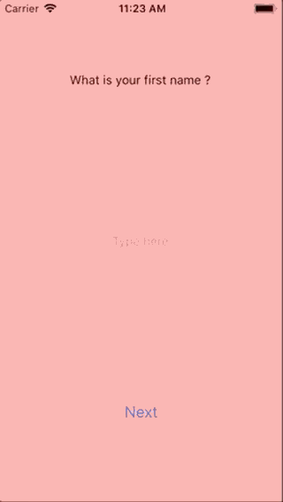
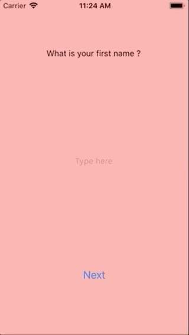
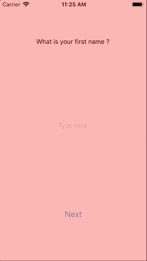

# Transitions

In order to use transitions between two screens, simply add the `Transitioner` key to your screens.

## Basic example

```ts
import React from 'react';
import { Canal, Screen, transitions } from 'react-gondola';
import { FirstName } from './FirstName';
import { LastName } from './LastName';

const { SlideLeft } = transitions;

const SignInCanal = () => (
  <Canal>
    <Screen name="firstname" Component={FirstName} Transitioner={SlideLeft} />
    <Screen name="lastname" Component={LastName} Transitioner={SlideLeft} />
  </Canal>
);
```

## Available transitioners

|                             Transitioner                              |                      transition                      |
| :-------------------------------------------------------------------: | :--------------------------------------------------: |
|                              `SildeLeft`                              |      |
|                               `SildeUp`                               |          |
|                              `ConvexUp`                               |                                                      |
| `RotateCrazy` (⚠️ experimental: this might be removed without notice) |  |

## Create your own transitioner

You can create your own transitioner if the one availables does not fit your needs ! Get some inspiration by looking at `SlideLeft` source code and get started !

1. Your transitioner need to extend `TransitionComponent`.
2. Your transitioner will receive a `directionForward` prop. If true, your transitioner need to play the transition forward. Else, it need to play the transition backward.
3. (Optionnal but recommended) If you use jest, you can test your component using `describeTransitioner` from `react-gondola/transitions/describeTransitioner`

⚠️ If you use jest and want to test you Transitioner wihch uses `react-native-reanimated`, make sure you correctly mocked `react-native-reanimated`.

```js
// in your jest setup file, use the following

jest.mock('react-native-reanimated/src/ReanimatedEventEmitter');
jest.mock('react-native-reanimated/src/ReanimatedModule', () => ({
  configureNativeProps: () => {},
  connectNodes: () => {},
  disconnectNodes: () => {},
  createNode: () => {},
  configureProps: () => {},
  getValue: () => {},
  dropNode: () => {},
}));
jest.mock('react-native-reanimated/src/derived/evaluateOnce');
jest.mock('react-native-reanimated/src/core/AnimatedProps');
```
